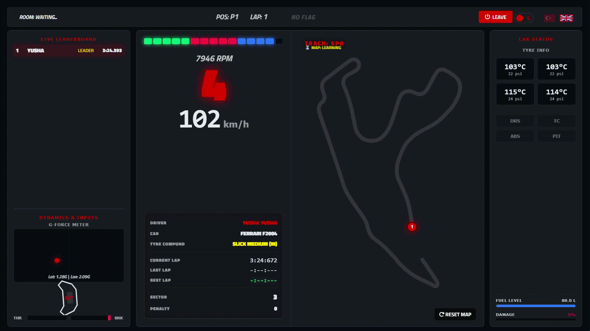
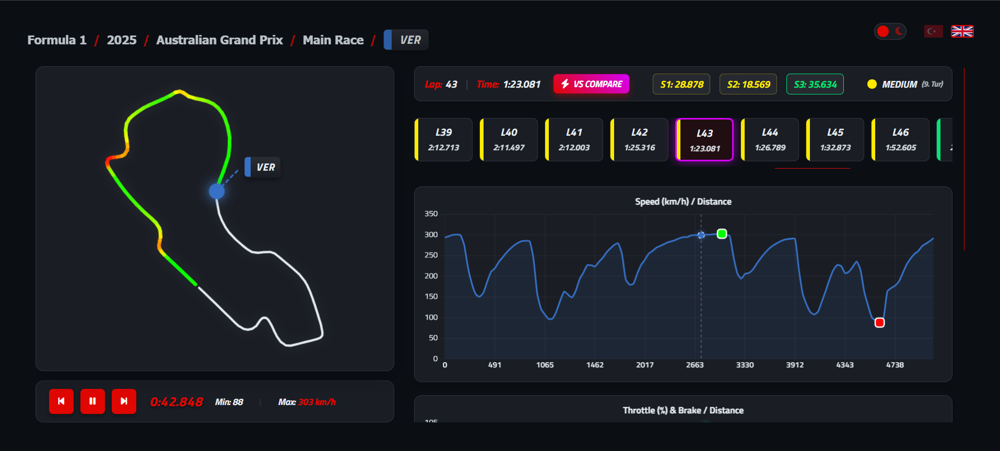
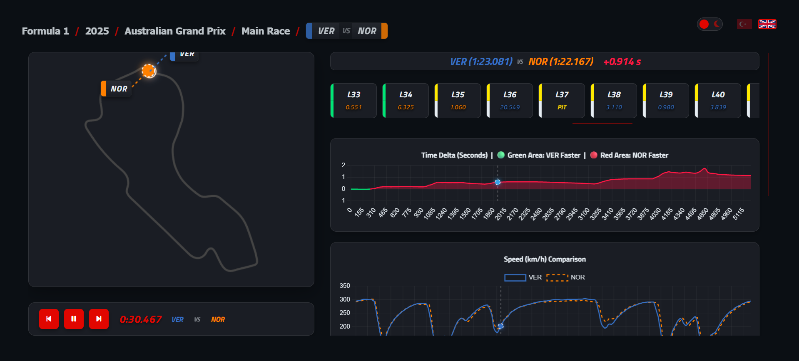
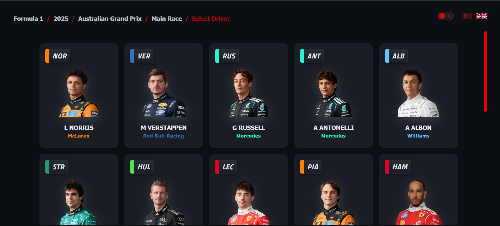
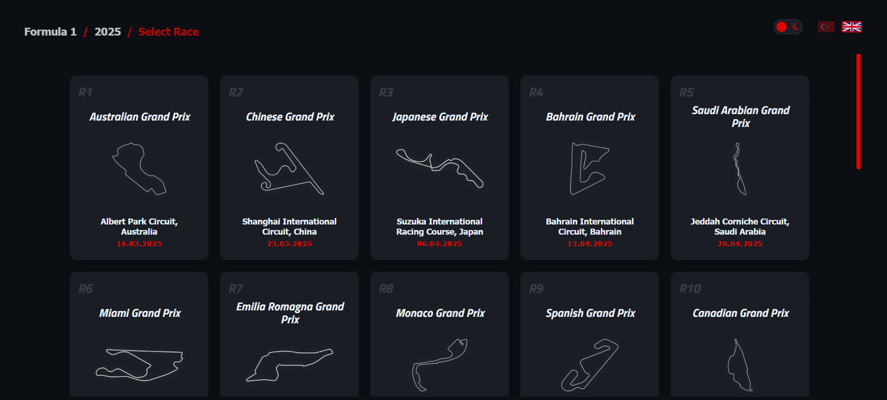

# Telemetria: Advanced Racing Telemetry & Analysis Platform
---
> *Experience real-time racing data and historical Formula 1 analysis directly in your browser.*

Telemetria is your ultimate web-based pit wall. Whether you are diving deep into historical (2018-2026+) Formula 1 data to uncover racing secrets or analyzing your own live laps in Assetto Corsa, Telemetria provides professional-grade insights without the need for heavy desktop software.   To start using Telemetria and connect with the live data, please ensure you read the 'Getting Started' section below.

## The Core Experience

Telemetria is divided into two powerful modules, designed for both motorsport analysts and sim racers.

### 1. The Formula 1 Telemetry Archive
Step into the shoes of an F1 data engineer. Telemetria allows you to navigate through historical racing data with a highly interactive and fluid interface.

* **Deep Dive Analysis:** Filter through seasons, race weekends, sessions, and individual drivers to pull precise telemetry from official F1 sessions.

* **Head-to-Head Compare Mode:** The ultimate showdown. Select two drivers from the same session and overlay their telemetry. A dedicated Time Delta chart reveals exactly where time was gained or lost down to the thousandth of a second.

* **Interactive Track Map & Playback:** More than just static lines. Play, pause, and scrub through laps with a dynamic track map simulation. In Compare Mode, watch both cars battle it out on the circuit simultaneously.
* **Synchronized Data Scrubbing:** Hover over any point on the telemetry graphs (Speed, Throttle, Brake, Gear, and DRS) and watch the cursor perfectly sync with the car's exact location on the track map.

### 2. Assetto Corsa Live Dashboard
Turn your browser into a live data center while you hit the track in Assetto Corsa. 

* **Seamless Cloud Connection:** Launch the TelemetriaClient to generate a unique 9-character Room Code. Enter it on the web platform, and your data streams instantly.
* **Self-Learning Live Radar:** As you drive, the platform automatically draws and learns the circuit layout, mapping your position and your competitors' positions in real-time.
* **Precision Driver Inputs:** Monitor your exact steering angle, throttle percentage, braking force, and a dynamic G-Force circle highlighting lateral and longitudinal loads.
* **Vehicle Diagnostics:** Keep a close eye on individual tyre temperatures and pressures, dynamic fuel consumption, and suspension/chassis damage.
* **Smart Race Control:** View live leaderboards and current flags (Yellow, Blue, Black). The system features an automated cut detector that flags invalid laps and official game penalties.
* **Intelligent Garage Mode:** When you enter the pits or pause the game, the dashboard automatically blurs and transitions into a clean "Garage Mode" overlay.

### Universal Features
* **Adaptive Interface:** Instantly switch between sleek Dark and Light themes to suit your environment.
* **Bilingual Support:** Fully localized in both English and Turkish for global accessibility.

---

## Getting Started

Getting up and running is incredibly simple. The heavy lifting is done on our servers.

### 1. Launch the Web Application
You do not need to install anything to analyze F1 data or view a live Assetto Corsa stream. Simply visit the live platform:

**Live Dashboard:** https://hasup.net/telemetria

### 2. Install the Assetto Corsa Mod
To broadcast your own Assetto Corsa telemetry to the web application, you need to install the lightweight Python Mod and Client.

1. **Download:** Grab the latest release from the official GitHub repository:
   > **Repository:** https://github.com/yushadev0/telemetria-assetto-corsa-mod
2. **Install via app or Copy Files:** You can use the installer which cames with release repo. Or you can extract the downloaded archive and drop the contents directly into your Assetto Corsa `apps/python/` folder.
3. **Enable the App:** Open Assetto Corsa (or Content Manager), navigate to **Settings > Assetto Corsa > Apps**, and check the box for **TelemetriaLB**.
4. **Hit the Track:** Once loaded into a session, open the TelemetriaClient and get your Room Code. Enter this code at `hasup.net/telemetria` (Assetto Corsa mode) and your live data will begin streaming immediately.

---

## Development & Contribution

Telemetria is built with a passion for motorsport. If you encounter bugs, have feature requests, or want to contribute to the code, feel free to open an Issue or submit a Pull Request on the Assetto Corsa mod repository.